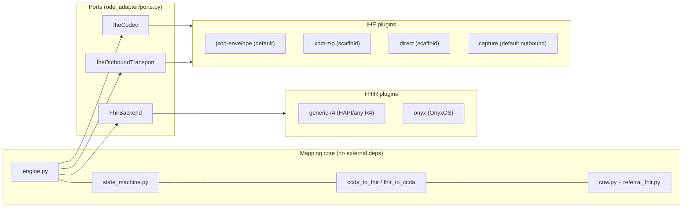
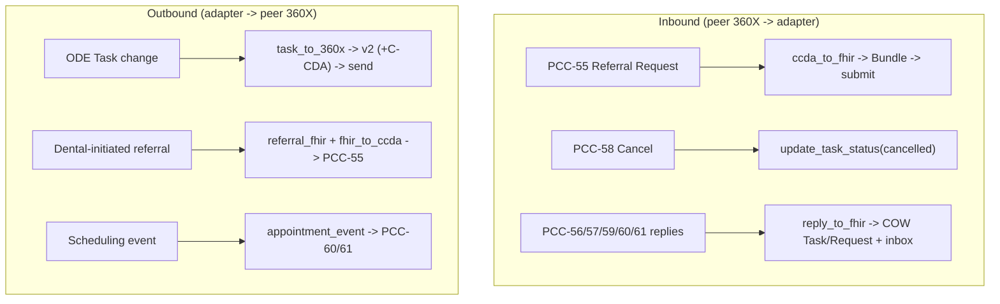

# Architecture & Repository Structure

This is a **plug-and-play** edge server. The C-CDA↔FHIR mapping core never depends
on a specific FHIR server or a specific 360X transport — it depends on three
**ports** (interfaces), and concrete **plugins** are selected at runtime. Swapping
HAPI for OnyxOS, or a JSON test envelope for real Direct/XDM, is a config change,
not a code change.

The adapter is **symmetric / bidirectional**: it bridges a 360X edge (medical EHR,
HL7 v2 + C-CDA) and an ODE Native edge (dental PMS, FHIR R4). It handles both
directions of travel and both roles — receiving a referral and *initiating* one —
and it ingests the peer's reply transactions back onto the COW `Task` state.

> **This is a software repository, not a FHIR IG.** It holds several *independent*
> implementations of the same design — Python, .NET (C#), and Java scaffolds — each
> self-contained in its own tree and buildable on its own. They are held together not
> by shared code but by the shared contract in `spec/`. This document describes the
> architecture they all follow, using the Python reference for concrete file names.
> The repo is *separate* from the FHIR Implementation Guide repositories, which are authored
> in FSH/SUSHI and published through the HL7 IG Publisher / packages.fhir.org. The
> adapter *consumes* the IG's profiles (see the ODE contract in `spec/`); it is not
> balloted with them.

---

## Ports and adapters



The engine imports `FhirBackend`, `IheCodec`, `IheOutboundTransport` — never a
concrete class. Plugins register themselves with the registry and are chosen by
name from config.

### The three ports (`ode_adapter/ports.py`)

| Port | Responsibility | Built-in plugins |
|---|---|---|
| `FhirBackend` | drive an ODE Native FHIR R4 server: `submit_referral_bundle`, `update_task_status` (status + businessStatus + owner/statusReason/note/period + output), `update_request_status`, `get_task`, `find_by_referral` | `generic-r4`, `onyx` |
| `IheCodec` | package ↔ envelope (XDM/XDR/JSON) | `json-envelope`, `xdm-zip` |
| `IheOutboundTransport` | send an outbound 360X message | `capture`, `direct` |

### Selecting plugins

By environment variable (or `ode_adapter/config.py`):

```bash
export ODE_ADAPTER_FHIR_BACKEND=onyx          # generic-r4 | onyx | <yours>
export ODE_ADAPTER_IHE_CODEC=xdm-zip          # json-envelope | xdm-zip | <yours>
export ODE_ADAPTER_IHE_TRANSPORT=direct       # capture | direct | <yours>
export ODE_ADAPTER_ODE_BASE_URL=https://ode-native.example.org/fhir
export ODE_ADAPTER_DRY_RUN=false
```

`GET /plugins` reports the selected and available plugins at runtime.

### Adding a plugin

Implement a port and register it — no core changes:

```python
from ode_adapter.ports import FhirBackend
from ode_adapter.registry import register

@register("fhir", "my-ehr")
class MyEhrBackend(FhirBackend):
    def submit_referral_bundle(self, bundle): ...
    def update_task_status(self, task_id, status, *, reason=None,
                           business_status=None, outputs=None, owner=None,
                           status_reason=None, note=None, period_end=None): ...
    def update_request_status(self, request_id, status, *, reason=None): ...
    def get_task(self, task_id): ...
    def find_by_referral(self, referral_id): ...   # optional; default []
```

In-repo plugins are imported by `ode_adapter/plugins/__init__.py`. **Third-party**
plugins ship in their own package and register via a Python entry point group
`ode_adapter.plugins` (the registry loads it lazily); no fork required.

---

## Layers

Layer 1 (transport/envelope), Layer 2 (workflow state), Layer 3 (semantic mapping).

- **`hl7v2.py`** — minimal HL7 v2 parse/build for the 360X workflow envelope. Also
  carries the *degraded* reply content: accepting provider (ORC-12), expected-by
  (ORC-15), coded status reason (ORC-16), free-text note (NTE), appointment
  start/end (SCH-11/12).
- **`xdm.py`** — inbound/outbound envelope models.
- **`state_machine.py`** — the ~1:1 workflow layer, two directions:
  - `task_to_360x` — an ODE `Task` change → the 360X transaction to emit
    (PCC-56/57/58/59).
  - `reply_to_fhir` — an inbound reply transaction (PCC-56/57/59/60/61) → the COW
    `Task`/`ServiceRequest` state change (used when *this* side initiated).
  - `appointment_event` — PCC-60 Appointment / PCC-61 No-Show.
- **`ccda_to_fhir.py`** — inbound C-CDA → FHIR transaction Bundle. Referral Note →
  Patient, referring **and** rendering providers, Condition, MedicationRequest,
  AllergyIntolerance, Coverage, an **ODEMedicationList** (`List`), a directional
  ServiceRequest, and a Task. Consultation Note (reply) → ClinicalImpression /
  CarePlan / Procedure / Observation / DocumentReference.
- **`fhir_to_ccda.py`** — outbound FHIR → C-CDA. **The loss profile lives here**:
  CDT / tooth numbering / periodontal findings have no structured C-CDA home, so
  they are rendered as flagged narrative (and reported as `loss_notes`). Builds both
  the Consultation Note (outcome/interim) and the rich Referral Note.
- **`cow.py`** — the scoped Clinical Order Workflows helpers: `businessStatus`
  concepts, `Task.output` wrapping, dental profiles, the `ODEMedicationList`, and the
  non-document reply resources (Appointment, Communication, interim/clearance
  Observations, accepting-provider owner role).
- **`referral_fhir.py`** — a structured referral intake → a rich FHIR transaction
  Bundle (Patient, Coverage, referring/rendering providers, Conditions, medications,
  directional ServiceRequest, Task, Provenance) — enough to diagnose, treat, and bill.

## Data flows (the two faces, both directions)



The engine methods: `handle_inbound` (routes PCC-55 / PCC-58 / reply transactions),
`handle_task_event` (outbound reply from an ODE Task change), `handle_referral_initiation`
(dental-initiated PCC-55), and `handle_appointment_event` (PCC-60/61). Reply
ingestion caches the FHIR it wrote on the episode so a harness "inbox"
(`GET /episodes/{referral_id}/inbox`) can show what a PMS/EHR would read.

## ODE Native contract conformance

Outbound FHIR conforms to the ODE Native contract (`spec/api/ode-openapi.yaml`,
`spec/mapping/360x-cow-crosswalk.md`):

- **Directional `ServiceRequest.meta.profile`** — `ode-medical-to-dental-referral`,
  `ode-dental-to-dental-referral`, or `ode-dental-to-medical-referral`, keyed by the
  referral `direction`.
- **Must-support coding** — medical-side receivers (medical→dental, dental→medical)
  do not carry CDT: CDT codings are dropped (text preserved); ICD-10 for diagnoses,
  CPT/HCPCS for services. Dental→dental keeps CDT.
- **`ODEMedicationList`** — a base-FHIR `List` (status `current`, mode `snapshot`,
  LOINC `10160-0`) aggregating the current-medication `MedicationRequest`s, referenced
  from `ServiceRequest.supportingInfo`.
- **`ODEReferralTask`** — the Task profile, with `businessStatus` drawn from
  `http://ohia-codes.org/CodeSystem/ode-referral-sub-status` (`received`, `accepted`,
  `declined`, `interim-results`, `outcome-final`, `appointment-booked`, …).
- **`referral-id`** — the loop key (`urn:ohia:referral-id`), used as the token search
  parameter for `find_by_referral` (with an `identifier` fallback).

---

## Repository structure

A polyglot monorepo of independent implementations that share only the `spec/`
contract. The **Python** package is the tested reference; **`dotnet/`** is a
dependency-free C# implementation at full parity; **`java/`** holds implementation
scaffolds; **`node/`** hosts the dual-persona demo UI. Each language tree builds and
runs on its own.

```
ode-360x-adapter/
├── README.md                  overview, quick start, mapping tables, conformance
├── ARCHITECTURE.md            this file (ports/adapters + repo structure)
├── CHANGELOG.md  CONTRIBUTING.md  PROGRAM-PLAN.md  LICENSE
├── docker/                    container assets for the test harness
├── docs/                      deploy / config / extending notes
├── spec/                      the normative ODE contract (source of truth)
│   ├── api/                   ode-openapi.yaml (vendored ODE Native contract)
│   ├── contract/ports.md      the port interfaces, documented
│   ├── mapping/               360x-cow-crosswalk.md (360X <-> COW/FHIR)
│   └── use-cases/             Connectathon scenarios
│
├── python/                    ★ the tested reference implementation
│   ├── ode_adapter/
│   │   ├── config.py          settings + plugin selection + systems/profiles
│   │   ├── ports.py           ★ FhirBackend / IheCodec / IheOutboundTransport
│   │   ├── registry.py        ★ plugin registry (name -> class, entry points)
│   │   ├── engine.py          orchestration; depends only on ports
│   │   ├── state_machine.py   Layer 2: task_to_360x + reply_to_fhir + appointment
│   │   ├── ccda_to_fhir.py    Layer 3 inbound:  C-CDA -> FHIR Bundle
│   │   ├── fhir_to_ccda.py    Layer 3 outbound: FHIR -> C-CDA + loss profile
│   │   ├── cow.py             COW helpers (businessStatus, med list, reply resources)
│   │   ├── referral_fhir.py   structured intake -> rich FHIR referral Bundle
│   │   ├── hl7v2.py           Layer 1: minimal v2 parse/build (+ reply fields)
│   │   ├── xdm.py             Layer 1: envelope models (in/out)
│   │   ├── stores.py          correlation store (episode + inbox) + directory
│   │   ├── app.py             FastAPI: the two faces + /plugins + /episodes/*/inbox
│   │   └── plugins/           ★ swappable implementations
│   │       ├── fhir/          generic_r4 (default), onyx
│   │       └── ihe/           json_envelope + capture, xdm_zip*, direct_smtp*, http*
│   ├── samples/               referral_request.xml, demo.py, inbound_pcc55.json
│   ├── tools/                 helper scripts
│   └── tests/                 test_adapter.py (self-contained runner)
│
├── dotnet/                    independent C# implementation at parity (dotnet/STATUS.md)
│   └── src/Ode.Adapter/ ...   Config, Cow, ReferralFhir, CcdaToFhir, FhirToCcda,
│                              Engine, StateMachine, Stores, Hl7v2, Plugins/
├── node/                      dual-persona demo UI (stdlib http, zero deps)
│   ├── server.js  lib/payloads.js  public/app.js
├── java/                      independent implementation scaffolds (ports package)
└── wiki/                      long-form docs
```

★ = the seams that make it plug and play.  (* = scaffold)

### Layering rule

Dependencies point inward: `plugins → ports → core`. The core (`engine`,
`state_machine`, `ccda_to_fhir`, `fhir_to_ccda`, `cow`, `referral_fhir`) must never
import a plugin or a concrete server/transport. Keep that rule and the adapter stays
portable — which is why each independent implementation can follow the same
module-for-module shape while sharing no code.
