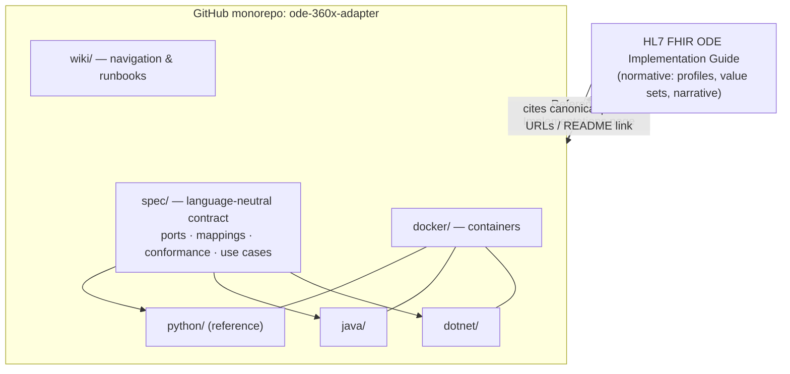

# ODE Reference Implementations — Program Plan

**Goal:** a complete reference ecosystem for the Oral Health Data Exchange (ODE) IG —
a FHIR Implementation Guide that points to a code repository; a repository that
points back to the IG; a wiki that guides people; and **three fully-functional
codebases (Python, Java, .NET)** implementing **all IHE 360X and FHIR/COW functions**,
each runnable in a container.

This is multi-week work, built in parallel by the OHIA community against one shared
contract. The near-term target (next 3 weeks) is narrower and concrete: references
that run the **head & neck cancer** and **pediatric referral** use cases for the
July 14–16 Connectathon.

---

## 1. The end state



Four properties define "done":
1. **IG ↔ repo are cross-linked.** The IG has a Reference Implementations page; the repo cites the IG's canonical URLs and links back.
2. **One contract, three languages.** `spec/` is the source of truth; all three implementations satisfy it.
3. **All functions.** Every 360X transaction (PCC-55…61) and the FHIR/COW functions, including real XDM/Direct transport and FHIR Subscriptions.
4. **Container-runnable.** `docker compose up` brings up a FHIR server + each adapter; an implementer runs a use case end-to-end with no local setup.

---

## 2. Repository architecture (done — Phase 0)

The monorepo is in place. The decisive design choice is `spec/` as the **contract**:
the mapping is the hard, language-neutral part (360X↔Task, C-CDA↔FHIR, the loss
profile), so it lives once in `spec/` and every language implements against it. That
is what keeps three codebases from becoming three architectures, and what lets OHIA
members contribute in their language of choice without drift.

```
ode-360x-adapter/
├── spec/        ← contract: ports, mappings, conformance checklist, use cases
├── python/      ← reference (PCC-55 + PCC-57 working; ports/plugins; runs in a container)
├── java/        ← ports expressed as interfaces; skeleton (community)
├── dotnet/      ← ports expressed as interfaces; skeleton (community)
├── docker/      ← compose: FHIR server + adapter
├── wiki/        ← navigation, quick-start, per-use-case runbooks
├── PROGRAM-PLAN.md, CONTRIBUTING.md, README.md, LICENSE
```

---

## 3. Phased roadmap

Phases overlap; workstreams (§4) run in parallel.

| Phase | Outcome | Who |
|---|---|---|
| **0 — Foundation** *(done)* | Monorepo, `spec/` contract, Python reference (PCC-55/57), containers + language skeletons | core |
| **1 — Connectathon references** *(next 3 weeks)* | UC01 + UC03 run end-to-end in Python, containerized, validated, with runbooks | core + UC SMEs |
| **2 — Python full build-out** | All 7 transactions, real XDM codec + Direct transport, FHIR Subscriptions, full C-CDA-on-FHIR mapping + validation, persistent store, tests, docs | core + community |
| **3 — Java & .NET to parity** | Each transaction/function ported against `spec/` + conformance; all three containerized | community (OHIA) |
| **4 — IG integration & conformance** | IG ↔ repo cross-linking; shared conformance suite runs all three in CI; wiki complete | core + community |

---

## 4. Workstreams (parallel; OHIA members plug in here)

- **WS-A — Python core**: transactions, mapping, plugins. *(reference pace-setter)*
- **WS-B — Use-case data & validation**: fixtures, benefit verification, clinical review. *(Connie/payers/dentists)*
- **WS-C — Transport**: real XDM codec, Direct/HISP send/receive, MDN.
- **WS-D — Java**: parity against `spec/`.
- **WS-E — .NET**: parity against `spec/`.
- **WS-F — IG + wiki + conformance harness**: cross-linking, shared test runner.
- **WS-G — Infra**: containers, CI, sandbox/server access.

Each workstream draws its "definition of done" from `spec/contract/conformance-checklist.md`, so parallel contributors converge instead of diverge.

---

## 5. Containerization

`docker/docker-compose.yml` already brings up **HAPI FHIR + the Python adapter**.
The path forward:
- Add a `Dockerfile` per language; add `adapter-java` and `adapter-dotnet` services as they become runnable.
- Add a Direct/XDM stub service for transport testing.
- Add a **conformance-runner** container that fires the `spec/` fixtures at each adapter and checks the results — the same suite that gates CI. This is how "all three pass the same tests" becomes real.

End state: `docker compose up` = a self-contained "Connectathon-in-a-box."

---

## 6. IG ↔ repo ↔ wiki linking

- **IG → repo:** add a *Reference Implementations* page to the IG (FSH/markdown) linking to the repo and to each `spec/use-cases/*`. Optionally, per-profile "see it used" links.
- **repo → IG:** the top `README` and `wiki/Home` link to the published IG URL; `spec/` cites IG profiles by **canonical URL** (so the contract and the IG stay aligned).
- **wiki:** `Home` (navigation) → Overview (IG relationship) → Quick-Start (Docker) → Use-case runbooks → By-language → Contribute → Conformance. Publish via the GitHub Wiki or GitHub Pages from `wiki/`.

---

## 7. Contribution model (OHIA members)

1. Pick an unchecked item in `spec/contract/conformance-checklist.md` (or a `good-first-issue`).
2. Implement it in one language against `spec/` — never by copying another language.
3. Validate against the shared `spec/` fixtures + checklist.
4. PR; CI runs only the affected language. Each language's `STATUS.md` tracks parity.

Behavior changes update `spec/` first, then the code. This is the guardrail that lets many hands work at once.

---

## 8. The 3-week sprint (Phase 1) — UC01 + UC03

**Sprint goal:** Python references that run **UC01 (head & neck cancer, medical→dental
clearance)** and **UC03 (pediatric referral, periodontitis via HIE)** end-to-end,
**in a container against a live FHIR server**, with a scenario test and a runbook
each — ready for the **July 14–16 Connectathon**.

> UC01 is already most of the way there: the Python reference's sample C-CDA *is* a
> head & neck dental-clearance referral. The sprint is mostly hardening UC01,
> building UC03, and getting both running on a live server in a container.

### Week 1 (Jun 26 – Jul 3) — UC01 on a live server, in a container
| Task | Owner (confirm) | Done when |
|---|---|---|
| Team review of `spec/` contract + monorepo | Mark | sign-off |
| `docker compose up` runs adapter against **live HAPI** (dry-run off) | WS-G | inbound POST persists to HAPI |
| Finalize UC01 fixtures per `spec/use-cases/uc01` (synthetic patient, real NPIs) | WS-B | fixtures committed |
| UC01 end-to-end on live HAPI in container (PCC-55 → Task → PCC-57) | WS-A | scenario test green |
| Decide UC01/UC03 server: **HAPI vs Onyx** | Mark + Scrimshire | decided; if Onyx, loading method resolved ⛔ |
| Kick off UC03 pediatric/perio data with Connie | Mark + J. Searls | content in hand |

### Week 2 (Jul 4 – Jul 10) — UC03 + close the loop
| Task | Owner | Done when |
|---|---|---|
| Build UC03 fixtures (pediatric Patient, periodontitis Condition, perio Observation) | WS-B | fixtures committed |
| Implement HIE→dental path for UC03 (Pattern C) | WS-A | UC03 runs end-to-end |
| Wire **PCC-56 (accept)** + **PCC-59 (interim)** so the full loop is demonstrable | WS-A | both UCs show accept→outcome |
| Validation: generated FHIR validates (US Core + provisional ODE profiles); C-CDA well-formed | WS-A | validators pass |
| Runbooks in `spec/use-cases/*` + `wiki/Quick-Start` | Mark | a member can follow them |

### Week 3 (Jul 11 – Jul 16) — rehearse & run
| Task | Owner | Done when |
|---|---|---|
| Dry-run both UCs against the Connectathon server(s) | team | both pass |
| OHIA onboarding: any member can `docker compose up` and run both UCs | Mark | verified by a non-author |
| Connectathon rehearsal + buffer | team | ready |
| **Connectathon (Jul 14–16)**; capture results as IG evidence | team | results logged |

### Sprint definition of done
- UC01 and UC03 each run end-to-end in a container against a live FHIR server.
- A scenario test for each is green in CI.
- Each has a runbook; an OHIA member who didn't write the code can run both.

### Sprint risks / blockers
- ⛔ **Server choice & loading** — if Onyx is used, confirm the OnyxOS load method (the `onyx` plugin's upsert path) with **[Mark Scrimshire]** before Week 1 ends. HAPI is the lower-risk default for these two use cases.
- ⛔ **TX Medicaid benefit verification** — only blocks the teledentistry use cases, *not* UC01/UC03; it can run in parallel and does not gate this sprint.
- **ODE dental profiles** (perio, tooth, CDT) may not be published yet — use **provisional profiles** in the reference for UC03 and flag them; the loss-profile path already works without them.
- **UC03 clinical data** depends on Connie — start Week 1 to de-risk Week 2.

---

## 9. Immediate next actions

1. Confirm owners for WS-A…G (which OHIA members take which language / workstream).
2. Decide HAPI vs Onyx for UC01/UC03 (recommend HAPI for the sprint; Onyx as a Phase-2 backend).
3. Greenlight the monorepo; open `good-first-issue`s mapped to the conformance checklist.
4. Start the UC03 data thread with Connie now.
