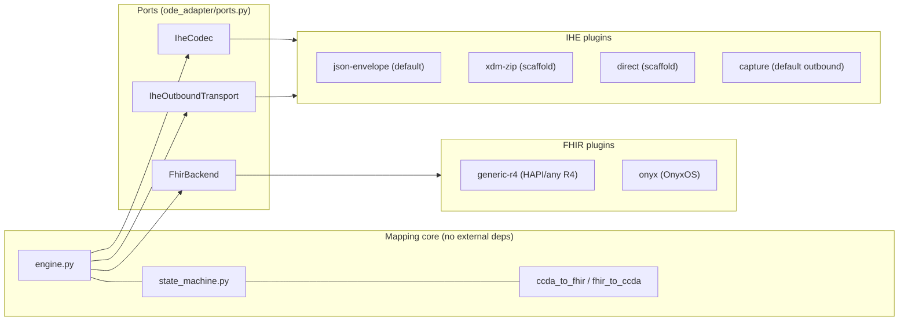

# Architecture & Repository Structure

This is a **plug-and-play** edge server. The C-CDA↔FHIR mapping core never depends
on a specific FHIR server or a specific 360X transport — it depends on three
**ports** (interfaces), and concrete **plugins** are selected at runtime. Swapping
HAPI for OnyxOS, or a JSON test envelope for real Direct/XDM, is a config change,
not a code change.

> **This is a software repository, not a FHIR IG.** It is plain Python and belongs
> in a normal GitHub repo (suggested: `lp-digitalhealth/ode-360x-adapter`). It is
> *separate* from the FHIR Implementation Guide repositories, which are authored in
> FSH/SUSHI and published through the HL7 IG Publisher / packages.fhir.org. The
> adapter *consumes* the IG's profiles; it is not balloted with them.

---

## Ports and adapters



The engine imports `FhirBackend`, `IheCodec`, `IheOutboundTransport` — never a
concrete class. Plugins register themselves with the registry and are chosen by
name from config.

### The three ports (`ode_adapter/ports.py`)

| Port | Responsibility | Built-in plugins |
|---|---|---|
| `FhirBackend` | drive an ODE Native FHIR R4 server (submit bundle, update Task, read) | `generic-r4`, `onyx` |
| `IheCodec` | package ↔ envelope (XDM/XDR/JSON) | `json-envelope`, `xdm-zip` |
| `IheOutboundTransport` | send an outbound 360X message | `capture`, `direct` |

### Selecting plugins

By environment variable (or `ode_adapter/config.py`):

```bash
export ODE_ADAPTER_FHIR_BACKEND=onyx          # generic-r4 | onyx | <yours>
export ODE_ADAPTER_IHE_CODEC=xdm-zip          # json-envelope | xdm-zip | <yours>
export ODE_ADAPTER_IHE_TRANSPORT=direct       # capture | direct | <yours>
export ODE_ADAPTER_ODE_BASE_URL=https://ode-native.example.org/fhir
export ODE_ADAPTER_DRY_RUN=false
```

`GET /plugins` reports the selected and available plugins at runtime.

### Adding a plugin

Implement a port and register it — no core changes:

```python
from ode_adapter.ports import FhirBackend
from ode_adapter.registry import register

@register("fhir", "my-ehr")
class MyEhrBackend(FhirBackend):
    def submit_referral_bundle(self, bundle): ...
    def update_task_status(self, task_id, status, reason=None): ...
    def get_task(self, task_id): ...
```

In-repo plugins are imported by `ode_adapter/plugins/__init__.py`. **Third-party**
plugins ship in their own package and register via a Python entry point group
`ode_adapter.plugins` (the registry loads it lazily); no fork required.

---

## Repository structure

```
ode-360x-adapter/
├── README.md                  overview, quick start, mapping tables, conformance
├── ARCHITECTURE.md            this file (ports/adapters + repo structure)
├── TODO.md                    path to a complete v1.0 reference
├── LICENSE                    Apache-2.0 (confirm)
├── pyproject.toml             packaging; core has zero deps; extras: server/fhir/direct
├── requirements.txt           convenience pins for the HTTP server
├── .gitignore
├── .github/
│   └── workflows/
│       └── ci.yml             lint + type-check + tests              (to add)
│
├── ode_adapter/               the package
│   ├── __init__.py
│   ├── config.py              settings + plugin selection
│   ├── ports.py               ★ FhirBackend / IheCodec / IheOutboundTransport
│   ├── registry.py            ★ plugin registry (name -> class, entry points)
│   ├── engine.py              orchestration; depends only on ports
│   ├── state_machine.py       Layer 2: 360X transaction <-> Task state
│   ├── ccda_to_fhir.py        Layer 3 inbound:  C-CDA -> FHIR Bundle
│   ├── fhir_to_ccda.py        Layer 3 outbound: FHIR -> C-CDA + loss profile
│   ├── hl7v2.py               Layer 1: minimal v2 parse/build
│   ├── xdm.py                 Layer 1: envelope models (in/out)
│   ├── stores.py              correlation store + directory (swappable)
│   ├── app.py                 FastAPI: the two faces + /plugins
│   └── plugins/               ★ swappable implementations
│       ├── __init__.py        registers built-ins on import
│       ├── fhir/
│       │   ├── generic_r4.py  any conformant R4 server (default)
│       │   └── onyx.py        OnyxOS — server-specific loading (PUT/UPSERT)
│       └── ihe/
│           ├── json_envelope.py  default codec + capture transport
│           ├── xdm_zip.py        real XDM ZIP codec            (scaffold)
│           └── direct_smtp.py    Direct/SMTP send              (scaffold)
│
├── samples/
│   ├── referral_request.xml   sample C-CDA Referral Note (dental clearance)
│   ├── demo.py                runnable end-to-end demo (no server needed)
│   └── inbound_pcc55.json     generated by demo; use with curl
│
├── docs/                       (to add — see TODO §9)
│   ├── mapping.md             full transaction + C-CDA↔FHIR + loss-profile catalog
│   ├── config.md              every setting, defaults, examples
│   ├── deploy.md              Docker, FHIR server, Direct/HISP, hardening
│   └── extending.md           how to add transactions / plugins / mappings
│
└── tests/                      (to add — see TODO §8)
    ├── test_hl7v2.py
    ├── test_ccda_to_fhir.py
    ├── test_fhir_to_ccda.py
    ├── test_state_machine.py
    ├── test_engine.py
    └── scenarios/             one test per Connectathon use case
```

★ = the seams that make it plug and play.

### Layering rule

Dependencies point inward: `plugins → ports → core`. The core (`engine`,
`state_machine`, `ccda_to_fhir`, `fhir_to_ccda`) must never import a plugin or a
concrete server/transport. Keep that rule and the adapter stays portable.
