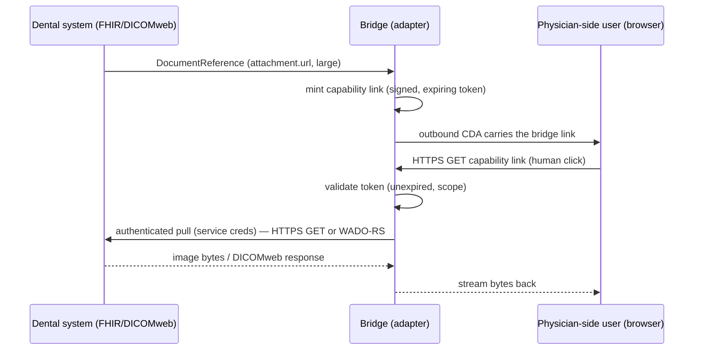

# Attachments & supporting images

How supporting information — images (intraoral photos, radiographs, dosimetry maps),
PDFs, additional documents — moves across the ODE/360X boundary. This is an **ODE
bridge convention**: neither 360X nor CDex defines the cross-paradigm linking below,
so the adapter owns it.

## Background: the 360X constraint

Every 360X transaction is an IHE XDM package limited to **"simple part" documents**,
and each clinical transaction carries exactly **two Document Entries — the HL7 v2
workflow message and one CDA clinical document**. There is no separate attachment
slot, and the Referral Request content table explicitly marks *Diagnostic Imaging
Report* as N/A. The only conformant way to put an image *inside* 360X is to embed it
in that single CDA as base64 (`observationMedia`, referenced from the narrative).

On the ODE Native (FHIR) side there is no such limit: an attachment is a
**DocumentReference** whose content is either inline bytes (`attachment.data`) or a
retrievable pointer (`attachment.url` → `Binary`/imaging endpoint). The dental-side
representation is modeled on CDex's **provider-to-provider** pattern (the Task Data
Request flow), **not** the claims-oriented `$submit-attachment` operation.

## The three cases

| # | Direction | Size | Mechanism on 360X side | Adapter action |
|---|---|---|---|---|
| 1 | physician → dentist (inbound) | any | embedded base64 in CDA | extract → ODE Native DocumentReference (+ bytes) |
| 2 | dentist → physician (outbound) | small (≤ threshold) | embedded base64 in CDA | read DocumentReference → embed bytes in CDA |
| 3 | dentist → physician (outbound) | large (> threshold) | **capability link** in CDA | mint bridge-hosted link → human-click → bridge proxies the pull |

The embed-vs-link decision in cases 2 and 3 is the **adapter's**, made on a
configurable byte threshold (see Configuration).

---

## Case 1 — inbound, physician → dentist (embed-only)

The initiating system is a 360X EHR, so any supporting image arrives **embedded** in
the inbound Referral Note CDA (base64 `observationMedia`). The adapter:
1. extracts each embedded media object from the CDA,
2. creates a FHIR **DocumentReference** on the ODE Native side with the bytes inline
   (`attachment.data`) or as a `Binary`, `contentType` set from the CDA media type,
3. links it to the referral (ServiceRequest/Task) so the dentist's system surfaces it.

**Intentional asymmetry — no inbound pull.** There is deliberately *no* inbound
mirror of case 3 (no link-resolution / TEFCA pull on the inbound side). Direct-only
EHRs are not building new retrieval functionality for us, so inbound is embed-only and
the adapter lives with whatever the sending EHR can embed. A stated **size ceiling**
applies (see Configuration); content above it is expected to be downsampled or omitted
by the sender, and the adapter records a loss note when an expected image is missing.

---

## Case 2 — outbound, dentist → physician, small (embed)

The dental system hands the adapter a **DocumentReference** (provider-to-provider
shape). If the payload is at or below the embed threshold, the adapter:
1. resolves the bytes (`attachment.data` inline, or fetches `attachment.url`),
2. embeds them as base64 `observationMedia` in the outbound CDA (Referral Outcome /
   Interim Note),
3. emits a loss note recording that the image was carried as embedded narrative.

"Send as binary" here means **raw bytes embedded in the CDA** — there is no FHIR
`Binary` on the 360X side.

---

## Case 3 — outbound, dentist → physician, large (capability link + proxy)

Images too large to embed (radiograph series, CBCT, multi-MB panos) are sent as a
**link the bridge hosts**, not a raw pointer to the dental PACS. Retrieval is
**human-click**: a physician-side user clicks the link in the forwarded message.

### Two trust hops — the bridge owns both
1. **Physician-clicker → bridge.** With human-click and no shared login, the link is a
   **capability URL**: the bridge mints a signed, expiring token when it builds the
   outbound CDA. Possession of the link is the credential.
2. **Bridge → dental endpoint.** The bridge authenticates with its **own service
   credentials** and pulls the bytes. The physician's office has no account on the
   dental system and never will.

The bridge therefore **proxies** (streams the bytes back through itself) — it does
**not** redirect the clicker to the dental endpoint, which would dead-end at a login
wall exactly like a bare portal link.

### Retrieval mechanisms
- **Default: authenticated HTTPS GET on a capability link.** Works for a typical
  Direct-only physician office (a human clicks; the browser does an ordinary GET).
- **Alternative: IHE imaging query.** For sites where both sides are on an
  imaging-exchange network, the bridge proxies **WADO-RS / DICOMweb**. Documented as
  an option; the capability-link GET is the default.

### Security model — capability URL is bearer security
Whoever holds the link can retrieve the image until it expires. Accepted given the
EHR constraints, with these mitigations (all configurable):
- **Short, bounded token lifetime** — default **7 days**.
- **Multi-use within the lifetime** — a human may click more than once.
- **Every retrieval audit-logged** (who/when/which token).
- Tokens are signed; tampered/expired tokens are rejected.

---

## DICOM / large imaging

Rendered images (JPEG/PNG/PDF) fit the Binary + link model directly. **DICOM** does
not: dental radiographs are frequently DICOM and CBCT volumes are hundreds of MB. For
those the correct FHIR shape is **`ImagingStudy` + WADO-RS/DICOMweb**, not a single
`Binary`. In case 3 the bridge proxies the DICOMweb endpoint (the "IHE imaging query"
mechanism above). Embedding (cases 1–2) is never appropriate for DICOM volumes.

---

## Adapter configuration (suggested defaults)

| Setting | Default | Purpose |
|---|---|---|
| `attachment_embed_max_bytes` | 512 KB | embed if ≤, else case-3 link (outbound) |
| `attachment_inbound_max_bytes` | 512 KB | inbound size ceiling (case 1) |
| `capability_link_ttl` | 7 days | capability token lifetime (case 3) |
| `capability_link_reuse` | multi-use | allow repeat clicks within TTL |
| `bridge_public_base_url` | — | base for minting capability links |

Base64 inflates payloads ~33% and large CDAs strain receivers, so the embed threshold
should be tuned conservatively to the receiving community's document-size limits.

---

## DocumentReference representation (provider-to-provider)

The dental-side attachment is a **DocumentReference** modeled on CDex's
provider-to-provider Task Data Request usage:
- `content.attachment.contentType` — the real media type (image/jpeg, application/pdf,
  application/dicom, …).
- `content.attachment.data` (inline) **or** `content.attachment.url` (pointer) — the
  adapter chooses by size per the threshold.
- linked to the referral (Task/ServiceRequest) and to the patient.

This is **not** the claims `$submit-attachment` operation. If a future flow wants the
dental system to actively invoke a CDex operation against the adapter, that is a
separate decision.

## Loss-profile integration

Every degraded path emits a loss note that names the retrieval method, so the
recipient is never left guessing:
- case 1: "image received embedded; surfaced as DocumentReference."
- case 2: "image carried as embedded CDA narrative (small)."
- case 3: "image available at <bridge capability link>; expires <ttl>; human retrieval."

## Conformance

- An adapter MUST extract embedded inbound media to a DocumentReference (case 1).
- An adapter MUST choose embed vs link by the configured threshold (cases 2/3).
- For case 3 it MUST mint a signed, expiring capability link, proxy the pull with its
  own credentials (never redirect), and audit each retrieval.
- An adapter MUST emit a loss note describing the retrieval path for any non-inline
  image.
- DICOM volumes MUST use ImagingStudy + WADO-RS/DICOMweb, never embedding.

## Open items

- Exact capability-token format (signing alg, claims) — implementation detail.
- Whether to offer single-use tokens as an option alongside the multi-use default.
- TEFCA/QHIN as a future inbound pull path (currently out of scope per the inbound
  asymmetry).
